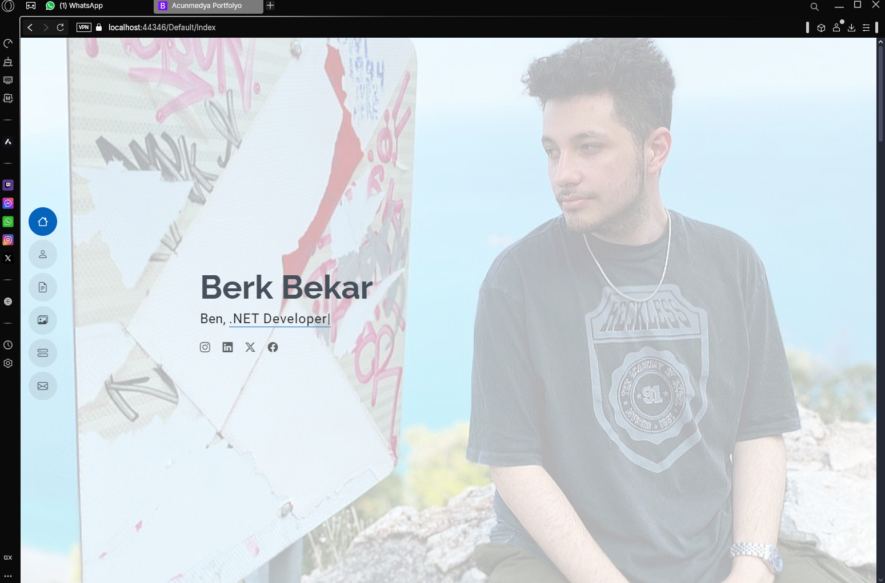
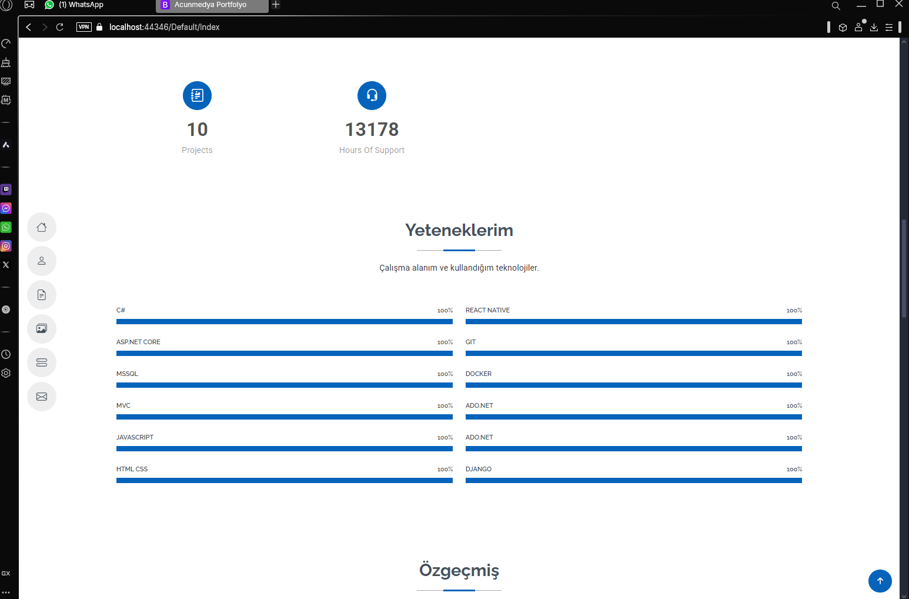
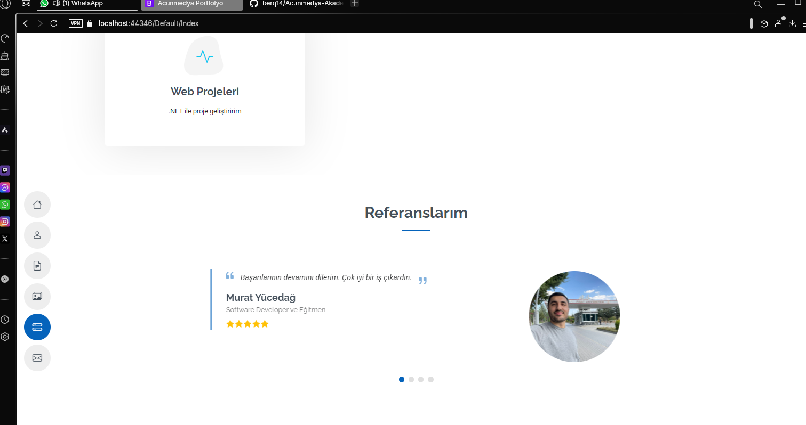
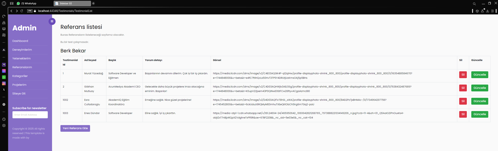
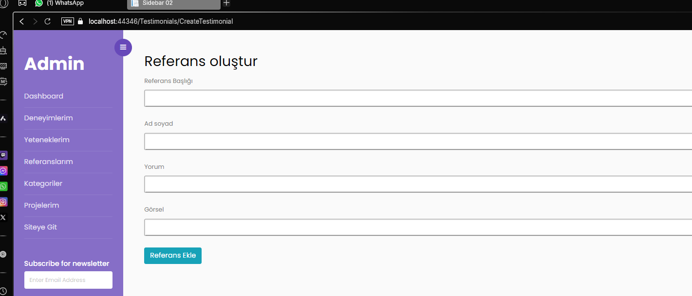
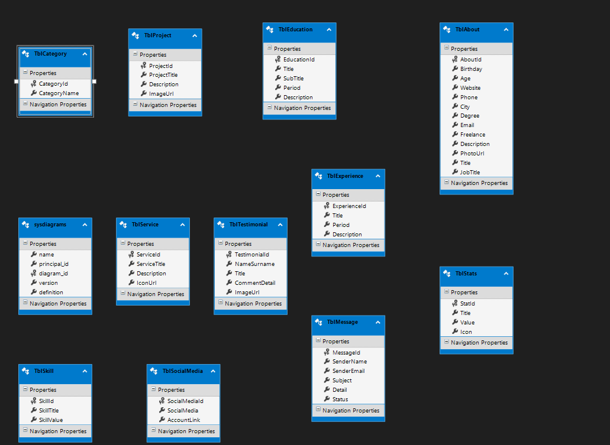

✨ AcunMedyaAkademi MVC Portfolyo Case ✨
Bu proje, AcunMedyaAkademi C# ile Programlama eğitimi kapsamında ödev olarak hazırlanmıştır.
 
 

🚀 Proje Özellikleri
 
🌟 Dinamik Veri Yönetimi: Kullanıcı bilgileri dinamik olarak eklenebilir, güncellenebilir ve silinebilir.
 

🛠️ Admin Paneli:
 

➕ Ekle
 
🗑️ Sil
 
✏️ Güncelle
 
📋 Listele özellikleri eklendi.
 
 
🧭 Navigasyon:
 
NavBar ve Sidebar özellikleri ile sayfalar arası yönlendirme sağlandı.
 
 
🔗 Sosyal Medya Entegrasyonu:
 
Kullanıcıları sosyal medya hesaplarına yönlendiren bağlantılar eklendi.
💬 Mesaj Gönderme Özelliği:
 
Site ziyaretçileri, iletişim paneli aracılığıyla mesaj bırakabilir.
 
 
💻 Kullanılan Teknolojiler
 
⚙️ ASP.Net MVC Framework: Proje altyapısı.
 
🛡️ Entity Framework: ORM aracı olarak kullanıldı.
 
🗄️ MSSQL Server: Veritabanı altyapısı oluşturuldu.
 
🎨 HTML, CSS, Bootstrap: Arayüz iyileştirmeleri yapıldı.
 
🔍 LINQ Sorguları: Veri sorgulama işlemleri için eklendi.
 
📂 PartialView: Sayfalar arası geçişleri kolaylaştırmak için kullanıldı.

