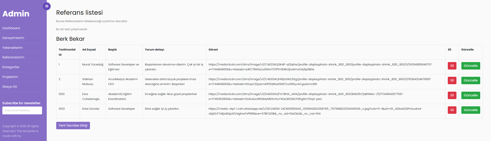

✨ AcunMedyaAkademi MVC Portfolyo Case ✨
Bu proje, AcunMedyaAkademi C# ile Programlama eğitimi kapsamında ödev olarak hazırlanmıştır.

🚀 Proje Özellikleri
🌟 Dinamik Veri Yönetimi: Kullanıcı bilgileri dinamik olarak eklenebilir, güncellenebilir ve silinebilir.
🛠️ Admin Paneli:
➕ Ekle
🗑️ Sil
✏️ Güncelle
📋 Listele özellikleri eklendi.
🧭 Navigasyon:
NavBar ve Sidebar özellikleri ile sayfalar arası yönlendirme sağlandı.
🔗 Sosyal Medya Entegrasyonu:
Kullanıcıları sosyal medya hesaplarına yönlendiren bağlantılar eklendi.
💬 Mesaj Gönderme Özelliği:
Site ziyaretçileri, iletişim paneli aracılığıyla mesaj bırakabilir.
💻 Kullanılan Teknolojiler
⚙️ ASP.Net MVC Framework: Proje altyapısı.
🛡️ Entity Framework: ORM aracı olarak kullanıldı.
🗄️ MSSQL Server: Veritabanı altyapısı oluşturuldu.
🎨 HTML, CSS, Bootstrap: Arayüz iyileştirmeleri yapıldı.
🔍 LINQ Sorguları: Veri sorgulama işlemleri için eklendi.
📂 PartialView: Sayfalar arası geçişleri kolaylaştırmak için kullanıldı.
